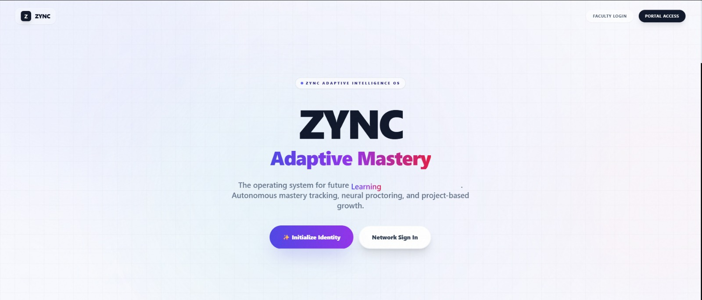

# ZYNC | Adaptive Mastery & Engagement Platform (AMEP)

**ZYNC** is a futuristic, **AI-first Educational Operating System** designed to bridge the gap between **students, educators, and administrators**.  
It combines **Google Gemini 3.0 / 2.5 models**, **real-time biometric intelligence**, and **adaptive mastery paths** into a single resilient learning ecosystem.

Built with a **“No-Fail AI Architecture”**, ZYNC guarantees that **critical demos, presentations, and study sessions never crash**, even during API outages.

<p align="center">
  
</p>

Preview: https://spring-fest.vercel.app/
---

## 🚀 Key Features

ZYNC operates through three powerful OS layers.

---

## 👨‍🎓 Student OS — *“The Learning Arc”*

### 🎥 Lecture Genius 2.0 (Resilient AI)
- **Vision-to-Notes:** Upload lecture videos to auto-generate:
  - Structured summaries  
  - Bulleted smart notes  
  - Flashcards  
- **Semantic Timeline:** Interactive timeline mapping key moments for instant navigation.
- **Tabbed Intelligence:** Switch between **Overview · Smart Notes · Quizzes · Flashcards**.
- **No-Fail Architecture:**
  - Smart PPE Mock Data activates instantly if AI APIs fail
  - UI remains functional during outages

---

### 🧠 Practice Arena
**Multimodal Adaptive Learning**
- If a student answers incorrectly, AI explains using:
  - Flowcharts  
  - Analogies & metaphors  
  - Concept maps  
  - Deep theoretical explanations  

**Modes**
- **Curriculum Mode:** Structured subject mastery  
- **Discovery Mode:** Generate quizzes on *any* topic instantly  
- **Lockdown Mode:** Exam simulation with **continuous 10-second biometric snapshots**

---

### 🧪 Project Lab (with Grounding)
- **Research Assistant:**  
  - Chat interface powered by **Google Search Grounding**
  - Enables real-time factual queries with citations
- **Peer Evaluation Bias Check:**  
  - Detects toxicity, bias, or unfair feedback
- **Growth Synthesis:**  
  - Anonymizes peer reviews
  - Produces a personalized **Growth Roadmap**

---

### 💼 Career Cell
- **AI Resume Review:**  
  - Upload PDFs
  - ATS scoring + rewrite suggestions
- **Mock Interview:**  
  - Voice-based roleplay
  - Analyzes confidence, clarity, and content
- **Job & Course Matching:**  
  - Recommendations based on mastery scores

---

### 💙 Wellness Wing
- **Lumi:** Empathetic AI mental-health companion  
- **Voice Journal:**  
  - Audio recording
  - Transcription
  - Sentiment analysis & mood trend tracking

---

## 👩‍🏫 Faculty Command Center — *“The Oversight Grid”*

### 📡 Live Classroom
- **Confusion Index:**  
  - Real-time heatmap from classroom visuals
  - Detects *Focused vs Confused* students
- **Inclusive Polls:**  
  - Broadcast live questions to student dashboards

---

### 📝 Grading Hub
- **Automated Soft-Skill Grading:**  
  - Teamwork
  - Creativity
  - Communication
- **Bias Detection:**  
  - Reviews qualitative peer assessments

---

### 🔒 Roster Isolation
- Teachers **only see analytics for students explicitly assigned to them**
- Enforced via **Admin Assignment Matrix**

---

### 📚 Lesson Plan Synthesizer
- Instantly generates:
  - Project-Based Learning (PBL) templates
  - Daily lesson plans aligned to curriculum

---

## 🛡️ Admin Central — *“God Mode”*

### 🧾 Identity Vault
- Provision **Student / Teacher / Admin** accounts
- Supabase SQL triggers auto-sync Auth → Profiles

---

### 🧩 Assignment Matrix
- Explicitly link **Students ↔ Teachers**
- Guarantees strict data-privacy boundaries

---

### 🚨 Safety Surveillance
- Upload security feed snapshots
- Vision AI detects:
  - Unauthorized access
  - Overcrowding
  - Safety hazards

---

### 🎓 Scholarship Engine
- AI matches students to financial aid using:
  - GPA
  - Interests
  - Economic background

---

## 🛠️ Technical Architecture

### ⚙️ Tech Stack
- **Frontend:** React 18, TypeScript, Vite
- **UI/UX:** Tailwind CSS, Framer Motion, Glassmorphism
- **AI SDK:** `@google/genai`
- **Models Used:**
  - `gemini-3-flash-preview` — Reasoning
  - `gemini-2.5-flash-preview-tts` — Voice
  - `gemini-2.5-flash` — Grounding & Maps
- **Backend:** Supabase (PostgreSQL, Auth, RLS)

---

### 🧠 The “No-Fail” AI Pattern
- All critical AI calls wrapped in strict `try...catch`
- **Strict JSON Schema Enforcement**
- **Fallback Logic:**
  - API quota hit
  - Network failure
  - Parsing error
- **Result:**  
  High-fidelity mock data swaps in silently → **UI never breaks**

---

## 📦 Installation & Setup

### 1️⃣ Prerequisites
- Node.js (v18+)
- Google AI Studio API Key
- Supabase Project

---

### 2️⃣ Clone & Install
```bash
git clone https://github.com/your-repo/amep-platform.git
cd amep-platform
npm install
```

### 3️⃣ Environment Variables
Create .env:
```env
API_KEY=your_google_gemini_api_key
```
Note: Supabase URL/Key are hardcoded in supabaseClient.ts for demo simplicity.
Move them to environment variables for production.

### 4️⃣ Database Schema (Supabase SQL)
```sql
-- 1. Profiles & Auth Trigger
create table public.profiles (
  id uuid references auth.users primary key,
  full_name text,
  role text default 'Student',
  email text,
  created_at timestamp with time zone default now()
);

create or replace function public.handle_new_user()
returns trigger as $$
begin
  insert into public.profiles (id, full_name, role, email)
  values (
    new.id,
    new.raw_user_meta_data->>'full_name',
    new.raw_user_meta_data->>'role',
    new.email
  );
  return new;
end;
$$ language plpgsql security definer;

create trigger on_auth_user_created
after insert on auth.users
for each row execute procedure public.handle_new_user();

-- 2. Core Tables
create table public.amep_user_stats (user_id uuid primary key, xp int, level int, updated_at timestamp);
create table public.amep_mastery (id bigserial primary key, user_id uuid, subject_id text, score int, last_updated timestamp);
create table public.amep_proctoring_logs (id bigserial primary key, user_id uuid, mode text, report_data jsonb, created_at timestamp);
create table public.amep_assignments (teacher_id uuid, student_id uuid, unique(teacher_id, student_id));
create table public.amep_wellness_entries (id uuid default gen_random_uuid() primary key, user_id uuid, transcription text, sentiment text, score int, advice text, created_at timestamp);
create table public.amep_event_plans (id bigserial primary key, user_id uuid, prompt text, checklist jsonb, email_draft text, budget_estimate text, created_at timestamp);
create table public.amep_polls (id text primary key, question text, options jsonb, is_active boolean, created_at timestamp);

-- Demo Mode Only
ALTER TABLE public.profiles DISABLE ROW LEVEL SECURITY;
```

### 5️⃣ Run Locally
```bash
npm run dev
```
Open: http://localhost:5173

## 🎮 How to Demo

### 🔐 Login
- Click **Initialize Identity** to create a new user
- Or use **Instant Neural Proxy** for instant access:
  - **Scholar**
  - **Faculty**
  - **Root**

---

### 👨‍🎓 Student Flow
- **Lecture Genius** → Upload a lecture video → Watch *Cinema Mode* auto-populate notes, chapters, and summaries
- **Practice Arena** → Select **Exam Mode** → Camera tracking and biometric monitoring activate
- **Project Lab** → Ask real-time, grounded research questions powered by AI

---

### 👩‍🏫 Teacher Flow
- **Live Classroom** → Upload a classroom image → Generate the **Confusion Index** heatmap
- **Dashboard** → Monitor engagement and identify at-risk students

---

### 🛡️ Admin Flow
- **Identity Vault** → Create new Student / Teacher / Admin users
- **Assignments** → Link students to specific teachers to enforce data isolation

---

## 📄 License
**MIT License**

<p align="center">
  Built with ❤️ using Google Gemini 3.0 & React
</p>
